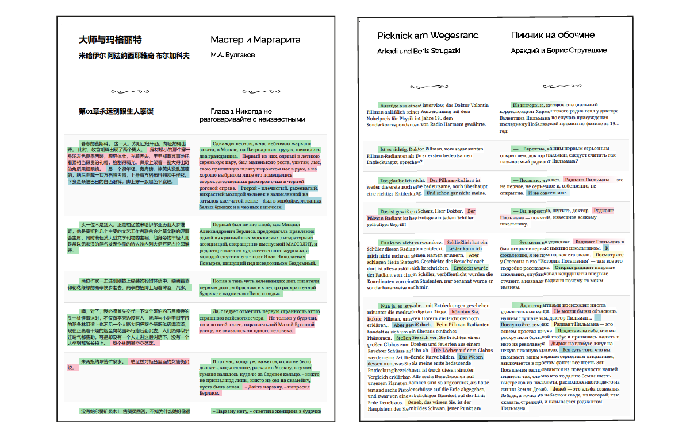

# Lingtrain Aligner

[](https://pypi.org/project/lingtrain-aligner)
[](https://pepy.tech/project/lingtrain-aligner)

**Lingtrain Aligner** is a powerful, ML-powered library for accurately aligning texts in different languages. It's designed to build parallel corpora from two or more raw texts, even when they have different structures.



## Key Features

- **Automated Alignment:** Uses multilingual machine learning models to automatically match sentence pairs.
- **Conflict Resolution:** Intelligently handles cases where one sentence is translated as multiple sentences, or vice-versa.
- **Multiple Output Formats:** Generates parallel corpora as separate plain text files or as a merged TMX file for use in translation memory tools.
- **Flexible Model Support:** Supports a variety of sentence embedding models, allowing you to choose the best one for your language and performance needs.

## Getting Started

### Installation

To get started with Lingtrain Aligner, install the library from PyPI:

```bash
pip install lingtrain-aligner
```

## Usage

Here's a simple example of how to align two texts:

```python
from lingtrain_aligner.aligner import Aligner

# Initialize the Aligner with the desired model
aligner = Aligner(model_name="distiluse-base-multilingual-cased-v2")

# Load your texts
original_text = "path/to/your/original/text.txt"
translated_text = "path/to/your/translated/text.txt"

# Align the texts
aligned_texts = aligner.align(original_text, translated_text)

# Save the aligned texts
aligner.save_aligned_texts("aligned_original.txt", "aligned_translated.txt")
```

## Supported Models

Lingtrain Aligner supports several multilingual models, each with its own strengths:

| Model | Key Features | Size | Supported Languages |
|---|---|---|---|
| **distiluse-base-multilingual-cased-v2** | Fast and reliable | 500MB | 50+ |
| **LaBSE** | Ideal for rare languages | 1.8GB | 100+ |
| **SONAR** | Supports a vast number of languages | 3GB | ~200 |

## How It Works

The alignment process faces several challenges, such as:

- **Structural Differences:** Translators may merge or split sentences.
- **Service Marks:** Texts often contain page numbers, chapter headings, and other non-content elements.

Lingtrain Aligner addresses these issues by:

1. **Preprocessing:** Cleaning and preparing the texts for alignment.
2. **Sentence Embedding:** Using a selected model to create vector representations of each sentence.
3. **Similarity Matching:** Comparing sentence vectors to find the best matches.
4. **Conflict Resolution:** Applying algorithms to resolve alignment conflicts.

The result is a high-quality parallel corpus suitable for machine translation research, linguistic analysis, or creating bilingual reading materials.

## Contributing

Contributions are welcome! If you have any ideas, suggestions, or bug reports, please open an issue on the [GitHub repository](https://github.com/averkij/lingtrain-aligner).

## License

This project is licensed under the GNU General Public License v3 (GPLv3). See the [LICENSE](LICENSE) file for more details.